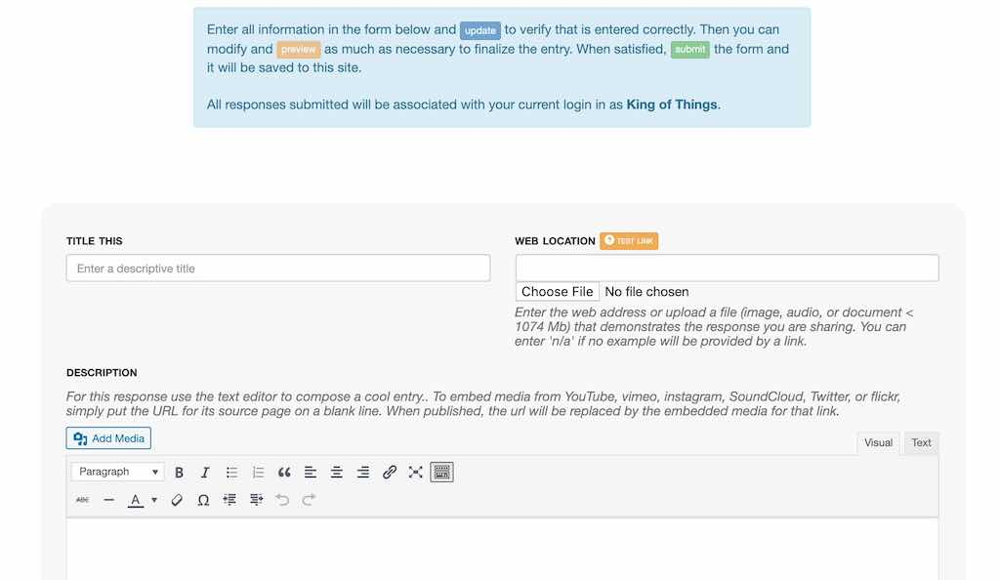

ds106 Assignment Bank Wordpress Theme
=========================
by Alan Levine http://cogdogblog.com/

ABOUT
-----
This Wordpress Theme allows you to create and customize a site that has all of the functionality of the [DS106 Open Assignment Bank](http://assignments.ds106.us/), to build a collection site of any collection of assignments, tasks etc, create a categorization, and then create or like ds106 allow your community to add to the collection.  You can find a live demo running at http://bank.ds106.us/

Generically I call the things inside the bank "Things" (internally you may find code references to "assignments").

So in the ds106 site, there are types of things (Assignments) such as [Design Assignments(http://assignments.ds106.us/types/designassignments/)], [Video Assignments(http://assignments.ds106.us/types/videoassignments/)], etc. Each assignment has a crowdsource difficulty rating; any site visitor add their own vote. 

A specific assignment, for example, the [Six Word Memoir(http://assignments.ds106.us/assignments/six-word-memoir/)] has a linked example, an associated icon (if the example lives on flickr, YouTube, vimeo, or SoundCLoud the site automatically embeds a media player), and a description. The site generates a unique pair of tags for each assignment. When a participant who has their blog registered at ds106, writes up their assignment with the tags, through RSS syndication the post gets attached as an example.

The idea for a general version is a site where types of "things" are created by the site owner(essentially categories).  They are displayed on a main index, which can bem but does not have to be, the entrance to your site:

Within each category is a collection of things

So we might have a site of "Challenges", and within there you might groups of Cooking Challenges, Fitness Challenges (think of them as categories). Within each are specific challenges to do, like "Make Bread From Scratch" "Cook Ham Bone Soup", or "Do 100 Pushups"). You can allows site visitors to add their own challenges via a web form. 

And each "thing" has its own page, with associated examples and tutorials:

The site options allow people to submit their responses to a challenge via a web form, or if part of an ongoing activity or community, to aggregate them in from external blogs (as [ds106](http://ds106.us) does).

This ds106 Assignment Bank Theme is build as a child theme of the [Wordpress Bootstrap Theme[(http://320press.com) chosen for its responsive layout and flexible grid display.

Hopefully it is flexible to meet many use cases. The design allows you to create a site where the front of the site is the menu of types of things, but that could also be an internal page, and a normal blog flow can be front and center. The theme does not create any of the navigation menus for you, but you will find suggestions as to the types of things you can make available via the built in Wordpress menu editor.

Requirements
------------
A self hosted ordpress hosted site (in other words "you cannot use this on Wordpress.com").  It can work on a multisite or as a single install. Depending on how you wish to run the site, you might install plugins below. You will also fins suggestions for Widgets that are useful for sidebars and footers.

Installing and Configuring the Theme
----------
1. Upload the **ds106banker** and the **wp-bootstrap** directories to your site's wp-content/themes directory. Or if you wish to install from within the Wordpress Dashboard, from **Appearance** select **Themes** and click the **Upload** links. You will have to create a zip file for each theme folder.
2. Activate the **ds106banker** theme.
3. Install Wp-Ratings and/or Feed Wordpress plugins according to the way you plan to use the theme.
4. Find the **Assignment Bank Options** listed both under the **Appearance** settings in the Wordpress Dashboard, or via the admin nav bar.
5. Create holding pages for the Main Index, the form to add examples, and a form for creating new "things" (see below)
6. Set the theme options (detailed in length below)
7. Customize the site menus, widgets. The theme provides a few shortcodes you can use on any page or sidebar.
8. Create some stuff

(3) Setting up WP-Ratings
----------
Install the [WP-Ratings plugin](http://wordpress.org/plugins/wp-postratings/) to activate the user thing rating feature. Not installing the plugin (or de-activating it) removes any ratings features from the site.

A few settings for the plugin are necessary. 

On the **Post Rating Options** choose the graphic style for the ratings- the suggestion is one of the stars settings with a max ratings of 5. Set the "Allow to Rate" option to **Registered Users and Guests** to allow any site visitor to cast a vote.

Set the **Post Ratings Templates**  as indicated below to reduce the clutter the default labels the plugin creates ("Most Rated" can be ignored)

* **Ratings Vote Text, Ratings None** Enter `%RATINGS_IMAGES_VOTE%`
* **Ratings Voted Text, Ratings No Permission Text, Highest Rated** Enter `%RATINGS_IMAGES%`

(3) Setting Up Feed Wordpress
----------
Install the [Feed Wordpress plugin](http://wordpress.org/plugins/feedwordpress/) if you wish to syndicate in responses to "thongs" as examples. This means that you can add blog feeds to the bank (it does the feed aggregation) or you can syndicate in from another site that is aggregating feeds (the ds 106 model). 

If this is not a desired feature, the plugin is not needed. You can still allow visitors to submit their examples via a web form.

A few settings must be made in Feed Wordpress to work correctly with the Assignment Bank Theme.

Under **Updates Scheduling** in the  **Feed and Updates Feed Wordpress Settings** set the  **set to automatically check for updates after pages load** to generate the process of feed checking. This is the easiest approach that is triggered by site activity- if you understand cron scripts you can set that up as an alternative.

**, set the option for Custom Post Types to **Examples Done**. What this does is to associate all syndicated posts with the content type that defines the examples. 

.

Setting Up Pages
----------
Three Wordpress pages must be set up, to create the main index of all things, another to house the form for adding a ne thing, and a third for users to add an example of a response to a thing.

1. Create a new page for a  **Main Menu** This generates the index of all types of things; they will be listed in the  order specified by your theme options. The title and content of the page (which you edit) is displayed above a grid of types of things. To enable the functionality, set the page template to **Assignment Menu** If you wish this page to be the front of the site, use the **Wordpress Reading Settings** to set the Front Page as a static page (if you plan to use the blog, create a blank page that you can use for a Posts page).
!(https://github.com/cogdog/ds106bank/blob/master/ds106banker/images/reading-settings.jpg)

2. Create a new page to **Submit New Things** You will need this even if you do not allow visitors to add them so you can add them yourself (the page can be unlinked or have a password set on it). The title and content of the page is displayed above the input form. To enable the functionality, set the page template to **Submit Assignments**.

3. Create a new page to **Submit Examples**. This form is used to allow visitors to add examples or tutorial for things via a web form. The title and content of the page is displayed above the input form. To enable the functionality, set the page template to **Submit Example/Tutorial Form**

Creating menus
----------

Yes This is Incomplete
---------------------
It's version 1 of the github code. gimme a break!

