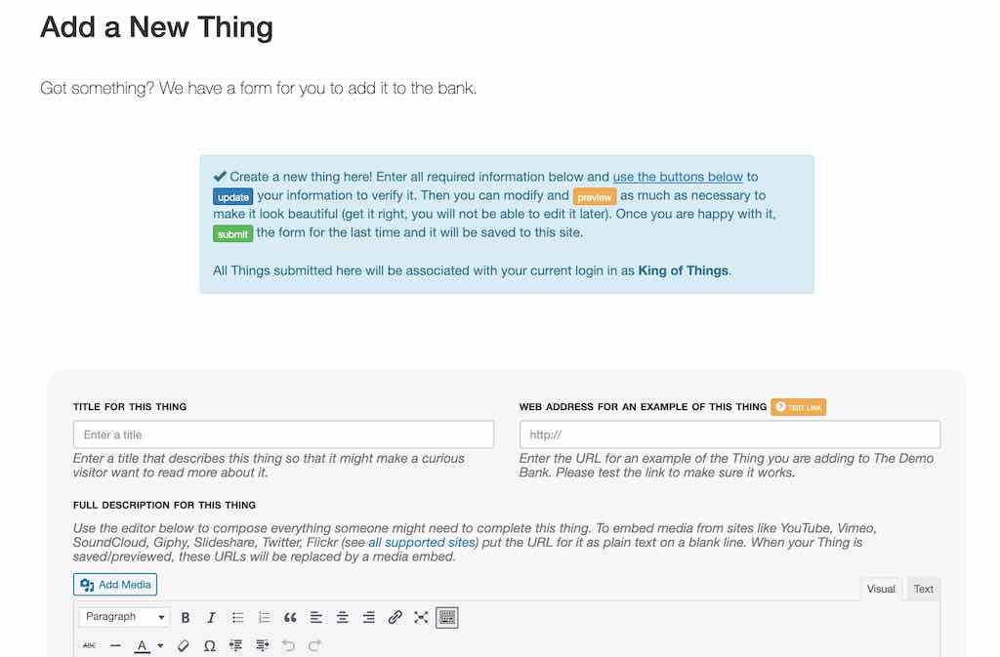

# ds106 Assignment Bank Wordpress Theme
by Alan Levine http://cogdog.info/ or http://cogdogblog.com/

## What is this?
This Wordpress Theme allows you to create and customize a site that has all of the functionality of the [DS106 Open Assignment Bank](http://assignments.ds106.us/), to build a collection site of any collection of assignments, tasks etc, create a categorization, and then create or like [ds106](http://ds106.us) allow your community to add to the collection.  You can find a live demo running at http://bank.ds106.us/

Generically I call the things inside the bank "Things" (internally you may find code references to "assignments").

So in the ds106 site, there are types of things (Assignments) such as [Design Assignments](http://assignments.ds106.us/types/designassignments/), [Video Assignments](http://assignments.ds106.us/types/videoassignments/), etc. Each assignment has a crowdsource difficulty rating; any site visitor add their own vote. 

A specific assignment, for example, the [Six Word Memoir](http://assignments.ds106.us/assignments/six-word-memoir/)] has a linked example, an associated icon (if the example lives on flickr, YouTube, vimeo, or SoundlLoud the site automatically embeds a media player), and a description. The site generates a unique pair of tags for each assignment. When a participant who has their blog registered at ds106, writes up their assignment with the tags, through RSS syndication the post gets attached as an example.

The idea for a general version is a site where types of "things" are created by the site owner(essentially categories).  They are displayed on a main index, which can bem but does not have to be, the entrance to your site:

Within each category is a collection of things

So we might have a site of "Challenges", and within there you might groups of Cooking Challenges, Fitness Challenges (think of them as categories). Within each are specific challenges to do, like "Make Bread From Scratch" "Cook Ham Bone Soup", or "Do 100 Pushups"). You can allows site visitors to add their own challenges via a web form. 

And each "thing" has its own page, with associated examples and tutorials:

The site options allow people to submit their responses to a challenge via a web form, or if part of an ongoing activity or community, to aggregate them in from external blogs (as [ds106](http://ds106.us) does).

This ds106 Assignment Bank Theme is build as a child theme of the [Wordpress Bootstrap Theme[(http://320press.com) chosen for its responsive layout and flexible grid display.

Hopefully it is flexible to meet many use cases. The design allows you to create a site where the front of the site is the menu of types of things, but that could also be an internal page, and a normal blog flow can be front and center. The theme does not create any of the navigation menus for you, but you will find suggestions as to the types of things you can make available via the built in Wordpress menu editor.

## Requirements
A self hosted Wordpress hosted site (in other words "you cannot use this on Wordpress.com").  This theme can work on a multisite or as a single install. Depending on how you wish to run the site, you might install plugins below. You will also find suggestions for Widgets that are useful for sidebars and footers.

## Installing and Configuring the Theme
(see headings below with the same number for more detail, there's a boat load of detail...)

1. Upload the **ds106banker** and the **wp-bootstrap** directories to your site's wp-content/themes directory. Or if you wish to install from within the Wordpress Dashboard, from **Appearance** select **Themes** and click the **Upload** links. You will have to create a zip file for each theme folder.
2. Activate the **ds106banker** theme.
3. Install Wp-Ratings and/or Feed Wordpress plugins according to the way you plan to use the theme.
4. Create holding pages for the Main Index, the form to add examples, and a form for creating new "things" (see below)
5. Set the theme options (detailed in length below). Find the **Assignment Bank Options** listed both under the **Appearance** settings in the Wordpress Dashboard, or via the admin nav bar.
6. Customize the site menus. The theme provides a few shortcodes you can use on any page or sidebar.
7. Other Suggested plugins
8. Create some stuff

### (3) Setting up WP-Ratings
Install the [WP-Ratings plugin](http://wordpress.org/plugins/wp-postratings/) to activate the user thing rating feature. Not installing the plugin (or de-activating it) removes any ratings features from the site.

A few settings for the plugin are necessary. 

On the **Post Rating Options** choose the graphic style for the ratings- the suggestion is one of the stars settings with a max ratings of 5. Set the "Allow to Rate" option to **Registered Users and Guests** to allow any site visitor to cast a vote.

Set the **Post Ratings Templates**  as indicated below to reduce the clutter the default labels the plugin creates ("Most Rated" can be ignored)

* **Ratings Vote Text, Ratings None** Enter `%RATINGS_IMAGES_VOTE%`
* **Ratings Voted Text, Ratings No Permission Text, Highest Rated** Enter `%RATINGS_IMAGES%`

### (3) Setting Up Feed Wordpress
Install the [Feed Wordpress plugin](http://wordpress.org/plugins/feedwordpress/) if you wish to syndicate in responses to "thongs" as examples. This means that you can add blog feeds to the bank (it does the feed aggregation) or you can syndicate in from another site that is aggregating feeds (the ds 106 model). 

If this is not a desired feature, the plugin is not needed. You can still allow visitors to submit their examples via a web form.

A few settings must be made in Feed Wordpress to work correctly with the Assignment Bank Theme.

Under **Updates Scheduling** in the  **Feed and Updates Feed Wordpress Settings** set the  **set to automatically check for updates after pages load** to generate the process of feed checking. This is the easiest approach that is triggered by site activity- if you understand cron scripts you can set that up as an alternative.

At the bottom of the **Posts and Links Feed Wordpress Settings**  in the section for **Custom Post Types (advanced database settings)**, set the option for Custom Post Types to **Examples Done**. What this does is to associate all syndicated posts with the content type that defines the examples. 

To the RSS feeds that Feed Wordpress syndicates, any tags or categories an incoming feed are actually associated as categories in the RSS structure. 

In the **Feed Categories & Tags Feed Wordpress Settings** check the options for **Match feed categories** and **Match inline tags** to include **Thing Tags** and **Tutorial Tags**. This will match all incoming tags to be associated with the taxonomy that organize the examples into the proper Thing types.

If you have no use for other tags in posts, under **Unmatched Categories** check the option for **Don't create any matching terms**. This keeps the database from being filled by un-used user tags/categories.

If you have any use to mark all of the syndicated posts, the options at the bottom of this screen allow you to add Wordpress tags or categories to them (e.g. add a "syndicated" tag).

### (4) Setting Up Pages
Three Wordpress pages must be set up, to create the main index of all things, another to house the form for adding a ne thing, and a third for users to add an example of a response to a thing.

1. Create a new page for a  **Main Menu** This generates the index of all types of things; they will be listed in the  order specified by your theme options. The title and content of the page (which you edit) is displayed above a grid of types of things. To enable the functionality, set the page template to **Assignment Menu** If you wish this page to be the front of the site, use the **Wordpress Reading Settings** to set the Front Page as a static page (if you plan to use the blog, create a blank page that you can use for a Posts page).

2. Create a new page to **Submit New Things** You will need this even if you do not allow visitors to add them so you can add them yourself (the page can be unlinked or have a password set on it). The title and content of the page is displayed above the input form. To enable the functionality, set the page template to **Submit Assignments**.

3. Create a new page to **Submit Examples**. This form is used to allow visitors to add examples or tutorial for things via a web form. The title and content of the page is displayed above the input form. To enable the functionality, set the page template to **Submit Example/Tutorial Form**

----------
### (5) Assignment Bank Theme Options
This theme has a comprehensive set of options, available via the **Assignment Bank Options## form the main admin toolbar.

#### Assignment Bank Options: General Settings: Things Settings

**Define the name of things** in the bank- the name here should be singular. This is used in numerous places throughout the site; note that changing this name will revise the name of the tags used to identify them for user tagging. You should set this very early in the setup process.

If you  allow users to submit new things to the site, you can set the **default status for new things** to Draft so you can moderate them. If the form will only be used by admins or i you allow new things to go directly to the site, set this option to Publish Immediately.

The **display order** controls how the types of things are sequenced on the main index; by title, order created, or by the number of things in each type. This order can be switched direction via the **display order sorting**.

The **excerpt length** is used to set the word length of short descriptions of examples and things on index pages (the Wordpress default is 55 words).

#### Assignment Bank Options: General Settings: Captcha Settings

Spam is a sad fact of life. Enabling this option will put a [Google reCaptcha](https://www.google.com/recaptcha) on all submission forms. You can use one of the four styles of captcha. Public and private keys are needed to use the captcha and [can be obtained from the Google Recpatcha site](https://www.google.com/recaptcha/admin/create)

#### Assignment Bank Options: General Settings: Media Settings

Set the width and height of thumbnail images on all index and archive pages. Any autoe-mbedded media (Youtube, vimeo, Soundcloud, flickr) will be sized to the width setting (default settings are 320px wide and 240px high)

The **single item media size** is how wide an image or embedded media will display on a single thing entry (default is 500px)

The **default thumbnail image** is what is used for a thing if not specified via the submission form. The image can be uploaded here to or selected from the Wordpress media library. The image should be at least larger than the default thumbnail width.

#### Assignment Bank Options: General Settings: Creative Commons Settings

Creative commons licenses can be attached to all things on the site. Choose **Apply one license to all challenges** to place the same license on all things (a notice will be displayed on the submission form). The license uses can eb selected from the menu,

Setting the Creative Commons options to **Enable users to choose license when submitting a challenge** will put the menu on the submission form so users can choose a license (or set to All Rights Reserved). At this time, the only way to reduce the number of license options is to edit `functions.php` in the template directory. Look for the function `function cc_license_select_options` and comment out the lines containing license options to hide.

#### Assignment Bank Options: General Settings: Settings for  Examples

By checking the first box, this  section allows you to enable a web form for site visitors to submit their examples as response to a thing (the form asks for name, email title, description, and a link).

For the link to the form to work, you must have previously created a Page that uses the **Submit Example/Tutorial Form** template. The drop down menu will list all pages on the site; choose the one that should house the form. If you want to not make the form public, just avoid adding menu links to it (or put a password on te form)

Finally, you can set whether a new example is published immediately or set to draft for moderation. All examples added to the site (by the form or via the syndication methods below) can be reviewed and edited via the dashboard menu for Examples Done. The most likely item to be edited is the URL for the example; it is stored in the Custom Field value for **syndication_permalink**.

#### Assignment Bank Options: General Settings: Settings for Syndication of Examples

The last section enables the features to syndicated in examples that users post on their own blogs. If this feature is not desired, leave the default setting for ** No syndication. Examples are added only via web form (if enabled above) or only via WordPress Admin** and ignore the rest of the settings.

There are two approaches to syndication, both require the [eed Wordpress plugin](http://wordpress.org/plugins/feedwordpress/) to be installed.

One is to turn the Assignment Bank site into its own syndication hub Use a local install of Feed Wordpress to aggregate examples to this site). This means that RSS feeds will have to be added directly to the local install of Feed Wordpress. The rest of the settings can be ignored. For a local syndication, users will only need to provide one tag, e.g. **Assignment12** to each of their posts for this site to be able to publish the examples directly to the Thing associated with it.

The second approach is the setup used for ds106; the assignment bank will rely on another set that is managing the direct syndication of user content. The local install of Feed Wordpress is used to "re-syndicate" the content to the bank. In this case, you must specify a **required tag** users should use to indicate a post is in response to something in the bank; the second tag specifies the thing it should be associated with. Finally the name and the URL for the example are used in the instruction text for each Thing.

#### Adding Feeds

At this time, all RSS feeds must be added to your site via the screen for **Feed Wordpress Syndication Sites**. The **add multiple** button opens a field where you can enter in a list of sites or feeds.

For each feed, you will have to confirm or select the correct Feed URL (some sites offer several options of Feed format or the content it finds as an RSS feed.

If you are using an external syndication site, you only need to add one feed- the one that corresponds to the tag entered in the **Required Tag** Assignment Bank option. If your required tag is **bank106**, than you want to bring in to this site only the posts on the syndication site that have this tag, for example:

`http://www.mycoolcourse.org/webhub/tag/bank106/feed`

It is recommended to test the feed first to make sure it is pulling in data and the correctly tagged content.

#### Assignment Bank Options: Thing Types

The second tab of the theme options is where you can create and edit the categories or types of things in your collection. You can add any number of new things by listing them one per line in the **Names for new types** field.

After clicking **Save Changes**, each type will now have its own editing field. They will be listed in the same display order you set in the General Settings.

The title can always be edited, and you can add/edit the short description. Then, use the build in interface to the Wordpress media library, upload a thumbnail image-- it should be larger then the default place holder image, but does not have to be the exact size. Wordpress will handle the image sizing for you.

Checking a type for deletion will remove it permanently upon saving.

----------

### (6) Creating Menus
The structure of the sites navigation is left to the owner; use the built in Wordpress menu editor to activate a top menu *the footer menu seems to not be formatted in the parent theme, and has been removed from the assignment bank footer.php template).

This means you can create any structure you like, including archives for the types of things. Below is the structure of the demo site:

A few special URLs are available, for say a site set up on `/bank.yourdomain.org` (the slug `assignments` is unfortunately basked in)

* `http://bank.yourdomain.org/assignments` an archive of all things
* `http://bank.yourdomain.org/assignments/?srt=random` a random thing
* `http://bank.yourdomain.org/examples` an archive of all examples added to the site

### (6) Shortcodes
These shortcodes can be used in an page, post, Widget

`[thingcount]` generates a count of all "things" in the bank such as **34 challenges**

`[examplecount]` generates a count of all "examples" in the bank such as **112 examples**

`[feedroll]`  If Feed Wordpress is installed, this shortcode generates a list of all subscribed blogs, useful as a sidebar widget. If feeds have different tags to segment them, a specific list can be produced by `[feedroll tag="section5"]`

### (6) Customizing CSS
Most of the theme's design is managed by the parent WP-Bootstrap theme. You do not to never edit that, right?

Because of the way styles are loaded, the typical child theme for the Assignment Bank [style.css](ds106banker/style.css) is blank except for the information needed to establish the relationship to the parent theme. Any custom style over-rides should be added to [style.css](ds106banker/ds106bank.css)

### (7) Other Suggested plugins
The following plugins are installed on the [demo site](http://bank.ds106.us/) to create useful sidebar/footer Widgets

* [Flexible Post Widget](http://wordpress.org/plugins/flexible-posts-widget/‎) provides a widget that can list the custom post types used in the theme; as used in the footer of the demo site, it can provide a  widget listing of randomly ordered "things" and "examples"

* [List Custom Taxonomy Widget](http://wordpress.org/plugins/list-custom-taxonomy-widget/‎) provides a widget like the built in Category widget, but for custom Taxonomies (the structure used to create the types of things). This widget can list all as links, plus put the count of items Within

