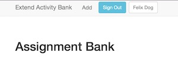
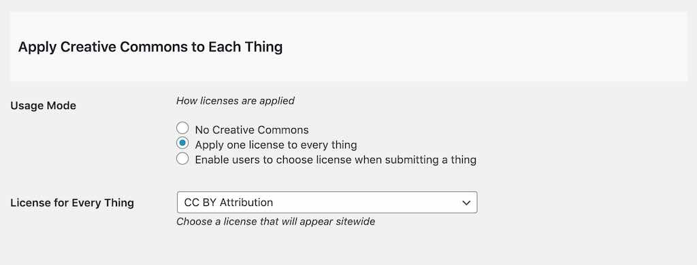

# ds106 Assignment Bank Wordpress Theme
by Alan Levine http://cog.dog/ or http://cogdogblog.com/

-----
*If this kind of stuff has any value to you, please consider supporting me so I can do more!*

[](https://patreon.com/cogdog) [](https://paypal.me/cogdog)

----- 


*[http://make.arganee.world/](http://make.arganee.world/)*

The DS106 Assignment Bank Theme is a Wordpress Theme allows you to create and customize a site that has all of the functionality of the [DS106 Open Assignment Bank](http://assignments.ds106.us/). With it you can build a site to house any collection of assignments, tasks etc, create a categorization, and then like [ds106](http://ds106.us) allow your community to add to the collection.  

Got a question? Suggestion? Feature Requests? Problem? A surplus of money? Please send them my way via [GitHub Issues](https://github.com/cogdog/ds106bank/issues) or directly to cogdogblog@gmail.com

## What Can You Build With This?
This Wordpress Theme is modeled after the original [DS106 Open Assignment Bank](http://assignments.ds106.us/) developed for the open digital storytelling course [DS106](http://ds106.us).

The banks we know of include:

* [Add Copy and Layout Challenge Bank](https://jmc3353.adamcroom.com/bank/) Adam Croom, JMC3353  University of Oklahoma
* [All The Toys](http://www.allthetoys.org/)
* [Bank of Things](http://splots.coventry.domains/demo/bank/) Template for installer on Coventry.domains
* [Box of Magic Web Tricks](https://cog.dog/roo/box/) Alan Levine, ISS Institute Tour Workshops, Nov 2017
* [Business Readiness Challenge Bank](http://business-wpl.com/) 
* [CALI Challenges](https://challenge.classcaster.net/)
* [Connected Learning Make Bank](http://clmoocmb.educatorinnovator.org/2014/)
* [Digital Learning Activities](http://tcoffman.org/INDT/)
* [eduToolkit](https://edutoolkit.org/)
* [Enriched Science Projects](http://enrichedscience.edcamp.se/) 
* [Foodworks Assignment Bank](http://foodworks.middcreate.net/assignments/) Middlebury College
* [HumanMOOC Activity Bank](http://humanmooc.com/activities/)
* [Ideas Bank](https://cte.openlcc.net/ideasbank/) Lansing Community College
* [Instructional Technology Assignments](http://tcoffman.org/INDT/) INDT501 at University of Mary Washington
* [Mobile Social Media Learning Technologies Project Bank](http://mosomelt.org/the-project-bank/view-all/) Aukland University of Technology
* [Ontario Extend Activity Bank](https://extend-bank.ecampusontario.ca/)
* [OER's for Transitional Learning](http://ctl.openlcc.net/oer/) Lansing Community College
* [Storied Make Bank](https://storied.kenyoncip.org/make/) Kenyon College
* [Teaching & Learning Knowledge Base](https://dlinq.middcreate.net/tlkb/) Middlebury College
* [Tiny Gigs](https://dlc.middcreate.net/tinygig/)  Digital Learning Commons, Middlebury Institute of International Studies at Monterey.
* [UBC Open For Learning Challenges](http://openlearning.sites.olt.ubc.ca/) University of British Columbia 
* [UDG Agora Challenge Bank](http://udg.theagoraonline.net/bank) University of Guadalajara Agora Project
* [Business Readiness Challenge Bank](http://business-wpl.com/) Faculty of Business, Justice and Behavioural Sciences at Charles Sturt University

Hey, if you know more...  let me know-- or better yet, DIY; please fork this in GitHub, add your example, and submit a pull request. That's how this git thing gets things!

For more details behind how this theme came to be see [related posts on CogDogBlog](http://cogdogblog.com/tag/106bank/).


## Terminology / Jargon
Generically I call the things inside the bank "Things" (internally you may find code references to "assignments", legacy of the first iteration of code).

So in the ds106 site there are types of things (Assignments) such as [Design Assignments](http://assignments.ds106.us/types/designassignments/), [Video Assignments](http://assignments.ds106.us/types/videoassignments/), etc. Each assignment has a crowdsourced difficulty rating; any site visitor add their own vote. 

A specific assignment, for example, the [Six Word Memoir](http://assignments.ds106.us/assignments/six-word-memoir/) has a linked example, an associated icon, and a description. The site generates a unique pair of tags for each assignment. When a participant who has their blog registered at ds106, writes up their assignment with the tags, through RSS syndication the post gets attached as an example.

The idea for a general version of this functionality in this theme is a site where types of "things" are created by the site owner (more or less categories).  They are displayed on a main index, which can be, but does not have to be, the entrance to your site.


Within each "type" is a collection of "things"


So we might have a site of "Challenges", and within there you might groups of Cooking Challenges, Fitness Challenges (think of them as categories). Within each are specific challenges to do, like "Make Bread From Scratch" "Cook Ham Bone Soup", or "Do 100 Pushups"). 

And each "thing" has its own page, with associated examples and tutorials:


The site options allow people to submit their examples created in response to a thing via a web form, or if part of an ongoing activity or community, to aggregate them in from external blogs (as [ds106](http://ds106.us) does).

You can allows site visitors to add their own challenges via a web form, this is [what made the DS106 assignment bank valuable](http://assignments.ds106.us/submit-an-assignment/).

**Note: You should always, always create your "things" via this form, even if you do not allow the public to do so.** The form adds a number of post custom field values necessary to make everything work. You can always modify these later, in the editor (making sure you make Custom Fields visible via screen options).


Besides descriptive information, a creator of an assignment can associate a new item with one or more types, and can also add free form tags to better describe it.  If the ratings capability is enabled, they can assign a first seed value for the rating. 

And if the option is used to let users submit to the site via a web form, they can add a set of instructions that are specific to just this assignment (the generalized instructions added to all assignments are entered as described below by a site option).

## Theming

This ds106 Assignment Bank Theme is built on and now (as of Nov 18, 2018) includes all code from [Wordpress Bootstrap Theme[(https://github.com/320press/wordpress-bootstrap) chosen for its responsive layout and flexible grid display (and sadly no longer being supported).  As a stand-alone theme, ypu are now free to generate your own child themes.

It is pretty basic on design, but hopefully flexible to your use cases. The design allows you to create a site where the front of the site is the menu of types of things, but that could also be an internal page, and a normal blog flow can be front and center. The theme does not create any of the navigation menus for you, but you will find suggestions as to the types of things you can make available via the built in Wordpress menu editor.

To make a child theme, when you create your `style.css` reference `ds106bank` as the template.

## Requirements

A self hosted Wordpress hosted site (in other words "you cannot use this on Wordpress.com").  This theme can work on a multisite or as a single install. Depending on how you wish to run the site, you might install plugins below. You will also find suggestions for Widgets that are useful for sidebars and footers.


## Installing and Configuring the Theme
*(see headings below for more detail, there's a boatload of detail...)*

Note: Do not upload the zip for this GitHub repo to install the themes. It won't work!

1. Download a ZIP file of this GitHub Repo (that's via the green **Clone or Download** button above as a file `ds106bank-master.zip`). The zip can be uploaded directly to your site via **Add Themes** in the Wordpress dashboard. If you run into size upload limits or just prefer going old school like me, unzip the package and ftp the entire folder into your `wp-content/themes` directory.
2. Activate the **ds106banker** theme (you do not have to activate the wp-bootstrap theme)
3. Install WP-PostRatings and/or Feed Wordpress plugins according to the way you plan to use the theme (see below).
4. Create / modify as needed pages for the Main Index, the page with a form to add examples, and a form for creating new "things" (see below).  The theme *should* create these for you, but if not you can create them and set the appropriate template as described below.
5. Set the theme options (detailed in length below). Find the **Assignment Bank Options** listed both under the **Appearance** settings in the Wordpress Dashboard, or via the admin nav bar.
6. Customize the site menus. The theme provides a few shortcodes you can use on any page or sidebar.
7. See other suggested plugins
8. Create some stuff


## Updating the Theme

If you have ftp/sftp access to your site (or this can be done in a cpanel file manager), simply upload the new theme files to the `wp-content/themes` directory that includes the older version theme. 

For those that lack direct file upload access or maybe that idea sends shivers down the spine, upload and activate the [Easy Theme and Plugin Upgrades](https://wordpress.org/plugins/easy-theme-and-plugin-upgrades/) plugin -- this will allow you to upload a newer version of a theme as a ZIP archive, the same way you add a theme by uploading.


-----

### Setting Up Pages
A few Wordpress pages should be created on theme activation, to create the main index of all things, another to house the form for adding a new thing,one  for users to add an example of a response or a tutorial to a thing, and yet one more to set up a help system.

If the pages are *not* created for you on theme activation...

1. Create a new page for a  **Main Menu**. This generates the index of all types of things; they will be listed in the order specified by your theme options. The title and content of the page (which you edit) is displayed above a grid of types of things. To enable the functionality, set the page template to **Assignment Menu** If you wish this page to be the front of the site, use the **Wordpress Reading Settings** to set the Front Page as a static page (if you plan to use the blog, create a blank page that you can use for a Posts page).


2. Create a new page to **Submit New Things** You will need this even if you do not allow visitors to add them so you can add them yourself (the page can be unlinked or have a password set on it). The title and content of the page is displayed above the input form. To enable the functionality, set the page template to **Submit Thing Form**.


**To repeat: You should always, always create your "things" via this form, even if you do not allow the public to do so.** The form adds a number of post custom field values necessary to make everything work. You can always modify these later, in the editor (making sure you make Custom Fields visible via screen options).


3. Create a new page to **Submit Examples**. This form is used to allow visitors to add examples or tutorial for things via a web form. The title and content of the page is displayed above the input form. To enable the functionality, set the page template to **Submit Example/Tutorial Form**


Note that this page is never viewed directly on it's own. It will be be linked from a single item page with additional paramaters to construct the full submission form.

4. Create a new page to manage the  **Help** pages for submission forms (this one must have a permalink/slug of **help**). The title and content of the page is displayed above the help content (specific for the type of content being created). 


----------

### Assignment Bank Theme Options

This theme has a comprehensive set of options, available via the **Assignment Bank Options** from the main admin toolbar.


#### Theme setup


On theme activation several pages will be created for you, but to make sure they are all present, click **Create Theme Specific Pages** -- it will generate ones needed that are not present.
Two pages specifically are used for forms on your site, one for adding new "things" and the other for adding a response to the things. If no Page is found with the correct template, you will see a prompt to create one. If the Page is found (and there might even be more than one, you can select the one you want used for each special page.


####  Things in this Bank


**Define the name of things** in the bank- enter both singular and plural correct names.

If you allow users to submit new things to the site, you can set the **default status for new things** to Draft so you can moderate them. If the form will only be used by admins or if you allow new things to go directly to the site, set this option to Publish Immediately.

For other ways to organize your Things across types you can enable the use of categories. For example, in a Bank of Assignments where they are organized by Types of Media (e.g. the original ds106 Assignment Bank), you could create a categorization based on different classes / courses using the bank.

If you do want to use categories, you set them up first in the Dashboard under **Things to Do** -&gt; **Thing Categories**. The Bank will recognize only one set of child categories is applied.

**Use Categories for _____** by default is set to no-- they will not be used at all on the site or visible, even if used in the past. The second option will present the categories on the public page when your site visitors create a new thing-- they check the appropriate boxes for categories.

But there might be cases where you want to categorize only on the back end; e.g. do not let users self categorize but do it when you moderate / review things added. This is the second "yes" option.

And if you use Categories but want to call them something else, like `Sections` enter that in the setting for **Label for Category**. This will be used on the entry forms and any where the categories are displayed.


#### Settings for Thing Responses and Tutorials


For some implementations, the display of a thing might not need examples, or tutorials or either listed. This new options allows you to set what is shown. If set to `both` they are displayed in two columns (default). If either is selected to display, it is shown as a single centered column, a bit wider. And by setting this option to `Neither` the listings of examples and tutorials is supressed.

Note that if not shown, you can still choose to have a form where either or both are added to the site.

Enable **Allow Uploads for Responses** to allow visitors to upload a file as a way of responding beyond entering a web address. You can limit to the file size of uploads.

The **Number of Responses to Display at a Time** is used if the **Ajax Load More** plugin us enabled, it will sequentially load this number of responses at a time.


By checking the first box, this section enables a web form for site visitors to submit their examples and support materials as response to a Thing (the form asks for name, email title, description, and a link). This page is only reached by following a link from a Thing, which passes it two variables to indicate the Thing, and whether it is an Example or a Tutorial.

If the expectation of the site is that users will be linking to their work as stored elsewhere (e.g. blogs or other user maintained site) check the option for **Link to Form Submitted Examples** to be **No, links go to example URL**.

On the other hand, setting this option to be **Yes, links go to entry on the bank site** sets the site up to house all submitted responses. A form will be presented with a rich text editor, that allows the users to preview and review their work before final submission. The rich text editor supports wordpress autoembeds.

As a new feature, you can add a set of instructions that will appear at the top of the example response submission form.

You can set whether a new example is published immediately or set to draft for moderation. All examples added to the site (by the form or via the syndication methods below) can be reviewed and edited via the dashboard menu for Examples Done. The most likely item to be edited is the URL for the example; it is stored in the Custom Field value for **syndication_permalink**.

Finally, the items added to the right side can be Resources, Tutorials, Extra links- and you can use **Name for Support Things** to define how they are labeled. The submission form for these offer a place for a title, URL, and a short description.

#### Media Settings


Set the width and height of thumbnail images on all index and archive pages. 

The **default thumbnail image** is what is used for a thing if not specified via the submission form. The image can be uploaded here to or selected from the Wordpress media library. The image should be at least larger than the default thumbnail width.


Enter a **default attribution** for this image.

Activating **Embed Media Icon** will use an assignments example media as an icon on archive listings (instead of the thumbnail) if the example URL can be embedded (e.g. YouTube video, SoundCloud audio, a tweet). The default is "no" or off.


#### User Options


**Use wordpress accounts for adding responses and/or items to the bank.** provides a bank owner the ability to use Wordpress user accounts to track activity.

If you enable the second or third options, a **Sign in** button will appear at the end of the navigation bar:


After logging in, a user will be redirected back to the page they were using. The menu bar will now display they name adjacent to what is now a log out button, and the display name will link to their archive of contributions.



If the setting is for a user account required, on the buttons that link to the form from a Thing, the button is disabled and a sign in button is provided:


If the user account is optional, the alert offers a chance to sign in as an option:


A lesson learned the hard way; never allow self-registration on WordPress sites where accounts get authoring privileges- this is a spam account magnet. The theme has an option for you to label the button as you see fit, but also to provide a link where it should go- it could be a page on the site with information on how to get an account or link to a managed signup form. Putting `#` in the link field will disable the button and it provides a Javascript alert that registration is not available.


The setting for **User names on submission forms** creates a field for a user to enter a desired username to identify their shared content (if not logging in); previously this was a twitter account but it cold be any unique name a user chooses; it acts more like a tag,

Whether a WordPress username or a user defined one, we use the convention of `@username` when displayed (again this is not linked to twitter). 

The default user name is a fall back if for some reason none was entered.


#### Apply Creative Commons to Each Thing



Creative commons licenses can be attached to all things on the site. Choose **Apply one license to all challenges** to place the same license on all things (a notice will be displayed on the submission form). The license uses can eb selected from the menu,

Setting the Creative Commons options to **Enable users to choose license when submitting a challenge** will put the menu on the submission form so users can choose a license (or set to All Rights Reserved). At this time, the only way to reduce the number of license options is to edit `functions.php` in the template directory. Look for the function `function cc_license_select_options` and comment out the lines containing license options to hide.

#### Thing Ratings


An indicator will show if the WP-Ratings plugin is installed for user ratings (see below).

Enable the **Allow Author Difficulty Rating** option to allow creators of new things to define their own rating of difficulty. This is completely separate from user popularity rating. 

#### Email Notifications


Enter email addresses (separated by commas) for notifcations of new Things submitted and/or Responses to things.

#### Twitter Options


These settings allow a Tweet This button to appear on your bank, and offers a way to add your own hashtags to the tweets.

##### Syndication for Responses


These settings offer a way to syndicate in examples that users post on their own blogs. If this feature is not desired, leave the default setting for **No syndication**. 

There are two approaches to syndication, both require the [Feed Wordpress plugin](http://wordpress.org/plugins/feedwordpress/) installed.

One is to turn the Assignment Bank site into its own syndication hub-- using a local install of Feed Wordpress to aggregate examples to this site. This means that RSS feeds will have to be added directly to the local install of FeedWordpress in a bank site. The rest of the settings here can be ignored. For a local syndication, users will only need to provide one tag, e.g. **Assignment12** to each of their posts for this site to be able to publish the examples directly to the Thing associated with it.

The second approach is like [the setup used for ds106](http://ds106.us/flow); the assignment bank will rely on another sitr that is managing the syndication of user content. The local install of Feed Wordpress is used to "re-syndicate" the content to the bank. In this case, you must specify a **required tag** users should use to indicate a post is in response to something in the bank; the second tag specifies the thing it should be associated with. Finally the name and the URL for the example are used in the instruction text for each Thing.


At this time, all RSS feeds must be added to your site via the screen for **Feed Wordpress Syndication Sites**. The **add multiple** button opens a field where you can enter in a list of sites or feeds.

For each feed, you will have to confirm or select the correct Feed URL (some sites offer several options of Feed format or the content it finds as an RSS feed.

If you are using an external syndication site, you only need to add one feed- the one that corresponds to the tag entered in the **Required Tag** Assignment Bank option. If your required tag is **bank106**, than you want to bring in to this site only the posts on the syndication site that have this tag, for example:

`http://www.mycoolcourse.org/webhub/tag/bank106/feed`

Test the feed first to make sure it is pulling in data and the correctly tagged content.


#### Captcha Settings

Spam is a sad fact of the internet. Enabling this option will put a [Google reCaptcha](https://www.google.com/recaptcha) on all submission forms.  Site and secret keys are needed to use the captcha and [can be obtained from the Google Recpatcha site](https://www.google.com/recaptcha/admin/create)

#### Thing Type Organization


These settings let you enter a name to represent the name for how you organize your things (they could be "Types", "Modules", etc), as well as the order and sorting for they way they appear on the front of the site.

#### Thing Type Editing 

Here is where you can create and edit the categories or types of things in your collection. You can add any number of new things by listing them one per line in the **Names for new types** field.

After clicking **Save Changes**, each type will now have its own editing field. They will be listed in the same display order you set in the General Settings.


The title can always be edited, and you can add/edit the short description. Then, use the build in interface to the Wordpress media library, upload a thumbnail image-- it should be larger then the default place holder image, but does not have to be the exact size. Wordpress will handle the image sizing for you.

Checking a type for deletion will remove it permanently upon saving.

----------

## Other Wordpress Stuff to Do

### Creating Menus
The structure of the sites navigation is left to the owner; use the built in Wordpress menu editor to activate a top menu the footer menu seems to not be formatted in the parent theme, and has been removed from the assignment bank footer.php template). Be sure to open the *Screen Options* so you can and more kinds of items to menus (like Thing Types, Thing Categories).

This means you can create any structure you like, including archives for the types of things. Below is the structure of the demo site:


A few special URLs are available, for say a site set up on `/bank.yourdomain.org` (the slug `assignments` is unfortunately basked in)

* `http://bank.yourdomain.org/assignments` an archive of all things
* `http://bank.yourdomain.org/assignments/?srt=random` a random thing
* `http://bank.yourdomain.org/examples` an archive of all examples added to the site

### Thing Categories
Under *Things to Do* you can add a category taxonomy that work like regular blog posts (*Thing Categories*); this allows another way to organize the things in your bank. If you do not create any categories, they will never be seen. But once you add a few, the will show up as selectable items on the Thing creation form.

### Shortcodes
These shortcodes can be used in any page, post, widget:

`[thingcount]` generates a count of all "things" in the bank such as **34 challenges**

`[examplecount]` generates a count of all "examples" in the bank such as **112 examples**

`[feedroll]`  If Feed Wordpress is installed, this shortcode generates a list of all subscribed blogs, useful as a sidebar widget. If feeds have different tags to segment them, a specific list can be produced by `[feedroll tag="section5"]`

#### Leaderboard Shortcodes
These codes can be used in posts or widgets to list the most active participants (if the option is enabled to track submissions by twitter name)

List all respondents in order of most active to least

	[bankleaders]

List the top 10 respondents

	[bankleaders number="10"]

List the top 10 respondents and exclude the ones identified in the hashtag taxonomy as ids 8 and 10

	[bankleaders number="10" exclude="8,10"]

List all the twitter names that have contributed new Things via the submission form 

	[bankleaders type="contributors"]
	
### Setting up WP-PostRatings for Popularity Ratings
Install the [WP-PostRatings plugin](http://wordpress.org/plugins/wp-postratings/) to activate the user thing popularity rating feature. Not installing the plugin (or de-activating it) removes the feature from the site. the purpose here is to allow visitors to rate Things, and provide sorting of things based on said ratings.

A few settings for the plugin are necessary (found in the new Ratings option in the Admin Sidebar).


On the **Post Rating Options** choose the graphic style for the ratings- the suggestion is one of the stars settings with a max ratings of 5 but any setting is viable. The suggested set up mode is to use the ratings as a measure of popularity, so the default `1 Star`, `2 Stars`, etc can be used. On the other hand, the original DS106 Assignment Bank was a crowd sourced measured of difficulty, so the labels could be customized as follows


Create any labels for your scale (these are used on the form to submit new Things). Set the "Allow to Rate" option to **Registered Users and Guests** to allow any site visitor to cast a vote.

Set the **Post Ratings Templates**  to customize the text displayed to show the ratings- the first two templates are used. **Ratings Vote Text:** designates how the ratings are shows; **Ratings Voted Text:** is shown as feedback and adds an indicated if a visitor has already voted; **Ratings None:** is shown for an item that has not been rated yet.

These templates are generally not used by Bank sites but certainly could be used: **Ratings No Permission Text:**, **Highest Rated:**, and **Most Rated:**


For a setup as a popularity voting, the **Ratings Vote Text** template might be:

```
Popularity: %RATINGS_IMAGES_VOTE% (**%RATINGS_USERS%** votes, average:
**%RATINGS_AVERAGE%** out of **%RATINGS_MAX%**)
<br />%RATINGS_TEXT%
```

For **Ratings Voted Text**:

```
Popularity: %RATINGS_IMAGES% (<em>**%RATINGS_USERS%** votes, average:
**%RATINGS_AVERAGE%** out of **%RATINGS_MAX%**; 
you have rated this</em>)
```

Finally, for **Ratings None**:

```
Popularity:  %RATINGS_IMAGES_VOTE% (No Ratings Yet)<br />%RATINGS_TEXT%
```

FYI the data for ratings are stored in three custom fields on all Things; they can be edited to adjust any rating if you can sort out the arithmetic:

* **ratings_score** is the total cumulative votes submitted (in the above example, 7)
* **ratings_users** is the number of people who voted (in the above example, 2)
* **ratings_average** is the value that will be displayed (in the above example, 3.5)

If you feel the vote of 5 by one person is too high, you might change the values to be ratings_score=2, ratings_users and ratings_average=2 to reduce the rating to 2. Changing votes is your decision.

### Author Challenge Ratings


Found under Appearance/Assignment Bank Options, enable this option to allow creators of new things to define their own rating of difficulty. This is completely separate from user popularity rating. 


### Setting Up Feed Wordpress
Install the [Feed Wordpress plugin](http://wordpress.org/plugins/feedwordpress/) if you wish to syndicate in responses to "things" as examples. This means that you can add blog feeds to the bank (it does the feed aggregation) or you can syndicate in from another site that is aggregating feeds (the ds 106 model). 

If this is not a desired feature, the plugin is not needed. You can still allow visitors to submit their examples via a web form.

A few settings must be made in Feed Wordpress to work correctly with the Assignment Bank Theme.


Under **Updates Scheduling** in the  **Feed and Updates** option under **Syndication Settings** set the dropdown menu to **set to automatically check for updates after pages load** to generate the process of feed checking. This is the easiest approach that is triggered by site activity- if you understand cron scripts you can set that up as an alternative.


At the bottom of the **Posts and Links** page of the **Syndication Settings** in the section for **Custom Post Types (advanced database settings)**, set the option for Custom Post Types to **Responses**. What this does is to associate all syndicated posts with the content type that defines the examples. 


To the RSS feeds that Feed Wordpress syndicates, any tags or categories in an incoming feed are actually associated as categories in the RSS structure. 

In the **Feed Categories & Tags** section of the **Syndication Settings** check the options for **Match feed categories** and **Match inline tags** to include **Thing Tags** and **Tutorial Tags**. This will match all incoming tags to be associated with the taxonomy that organize the examples into the proper Thing types.

If you have no use for other tags in posts, under **Unmatched Categories** check the option for **Don't create any matching terms**. This keeps the database from being filled by un-used user tags/categories.

If you have any use to mark all of the syndicated posts, the options at the bottom of this screen allow you to add Wordpress tags or categories to them (e.g. add a "syndicated" tag).

###  Customizing Your Bank

The WordPress Customizer used used to manage the appearance of your site as well as to edit the labels and prompts on your forms. This theme creates it's own special section, plus others you can use.


Open the "Thing Bank" panel to find two panels for customizing the forms on your site.


####  New Thing Form Prompts

This panel lets you modify form labels and prompts for your own site, some examples to see how it works. The forms will change in real time as you change the text on the left. It helps if you first navigate to the form, and then open the Customizer.


####  Response/Resource Form Prompts

In similar way, you can edit the form visitors to your site use to enter their response to things/assignments as well as contributing resources/tutorials. It helps if you first navigate to the form, and then open the Customizer. Note that the same prompts are used for both adding a response and adding a resource (if they are activated on your site).


#### Add a Header Image


You can  upload a header image via the Wordpress Customizer. The size is relatively short (60px) since it is fixed with the scroll of the navbar. But it's room to fit a small logo that links to the home page. It will work best if the image is 970px wide and 60px high. A background transparent PNG will really look nice!

#### Add Custom CSS 

This is best done on the Customizrr too.


### Other Suggested plugins

The following plugins are useful for a bank.

* [Flexible Post Widget](http://wordpress.org/plugins/flexible-posts-widget/‎) provides a widget that can list the custom post types used in the theme; as used in the footer of the demo site, it can provide a  widget listing of randomly ordered "things" and "examples"


* [List Custom Taxonomy Widget](http://wordpress.org/plugins/list-custom-taxonomy-widget/‎) provides a widget like the built in Category widget, but for custom Taxonomies (the structure used to create the types of things). This widget can list all as links, plus put the count of items Within


* By default, the search on the site searches all Things, if you wish to have a broader search (say for a blog attached, or for examples too, add the [Search Everything](https://wordpress.org/plugins/search-everything/) plugin. You will also have to modify `header.php` and remove or comment out this line

```
<input type="hidden" name="post_type" value="assignments" />
```

* This theme's stylesheet has been set up to work with the Fluid Project [User Interface Options Wordpress plugin](https://github.com/fluid-project/uio-wordpress-plugin) which adds a series of accessibility options to a site. This is only made available when the plugin is activated.


## What's New?

* Dec 2, 2019: Major new features and improved underlying code. Forms for adding assignments/things and responses can now insert images into body text (with tinyMCE uploader). Responses to assignment can upload a file rather than just entering a link. Options full developed for offering login optional or required, and user profiles for logged in users display a full profile of constibutions, organized by the type of thing (see [Ontario Extend Example](https://bank.ecampusontario.ca/author/cogdogblog@gmail.com)). Updated old Recaptcha to Google captcha 2.0.
* Nov 18, 2018: Rolled this theme and it's previous parent WP-Bootstrap (no longer updated) into a single theme, so now child themes can be generated from this (also easier installs). To update an existing site, first switch your theme to somering like Twenty-Seventeen, upload this new version to replace the older child theme (you can later delete WP-Bootstrap) then switch back to DS106 Assignment Bank
* Mar 12, 2018: CSS support for [User Interface Options plugin](https://github.com/fluid-project/uio-wordpress-plugin)
* Oct 16, 2017: New site option to include a general set of instructions to appear when responding to an assignment. In addition, each assignment can include extra instructions that are specific to it. Both of these will appear at the top of the form when used to submit a reponse.
* June 22, 2017: New Assignment Bank options to make use of Wordpress user accounts to track contributions, either optionally or make it require. In the latter case, submssion forms are hidden until a visitor has logged in.
* May 30, 2017: Added capability for thin header image atop nav bar that can be added via theme customizer (60px high)
* Feb 2, 2017: There is a new field on adding a new "thing" for extra information, such as attribution credit for it's thumbnail image or other ancillary content. When published, it is displayed below the description in a blue info box. Javascript generated previews for Things and Examples updated to correctly mark paragraphs in content. Default thumbnail size bumped to 640x480 and CSS updated on archive listings to better preserve proportions.
* Sep 29, 2016: Added a category-like taxonomy for things, another way to organize them. The primary "bins" are the "types" that appear on the main menu. But now you can also use categories to organize things across these bins. Because I was using the Wordpress Category taxonomy for responses, I had to create a new one, with an archive template. Through the options panel, you can choose to not use the categories; to allow site users to select categories when they create Things; or to leave that as an option for site moderators to do. You can also assign it a different label than "Category" when displayed on the site.
* Jul 16, 2016: Finally revamped the Options interface to overcome a bug in the broken tabbed display of sections. All settings are now on one long scrolling tab, a second one is used for documentation. Also added a new feature by request of Jim Luke for options to suppress the section of tutorials and/or examples on the single Thing display 
* May 3, 2016: New theme option to allow for archive views of assignments to use the embed-able media of it's example as an icon (e.g. YouTube video) rather than the thumbnail.
* May 30, 2015: Major updates for UDG Agora project- vastly improved submission forms with previews, options to track users by twitter handle, improved single layout, leaderboard.

-----

### Licensely Yours

    This theme is Copyright (C) 2014 Alan Levine http://cog.dog/ http://cogdogblog.com/

    This program is free software: you can redistribute it and/or modify
    it under the terms of the GNU General Public License as published by
    the Free Software Foundation, either version 3 of the License, or
    (at your option) any later version.

    This program is distributed in the hope that it will be useful,
    but WITHOUT ANY WARRANTY; without even the implied warranty of
    MERCHANTABILITY or FITNESS FOR A PARTICULAR PURPOSE.  See the
    GNU General Public License for more details.

    You should have received a copy of the GNU General Public License
    along with this program.  If not, see <http://www.gnu.org/licenses/>.


